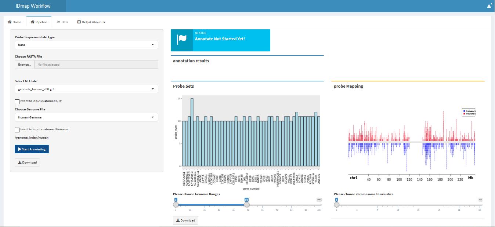

```{r setup, include = FALSE}
knitr::opts_chunk$set(
  collapse = TRUE,
  comment = "#>"
)
```


```{r echo=FALSE, results='hide', message=FALSE}
library(GEOquery)
library(IDmap)
```


## 1. Introduction
IDmap is a database contains 146 probe annotations which integrated of Soft Annotations from GEO , Bioconductor Annotations from Bioconductor as well as Customed probe annotations annotated by our pipeline.IDmap allows users to quickly and easily access the latest probe annotations and improve their data analysis qualities.

In addition, IDmap web-interface (http://192.144.162.230:3838/IDmap/)  provides a self-annotating workflow that helps users quickly get customed probe annotations.

```{r}
#library(IDmap)
```

## 2. Accessing probe annotation data from IDmap database
Before get annotation data from IDmap, please use function `checkgpl` or `getGPLlist` to check your GEO Platform is in our annotation list. Otherwise, you can use our `IDmap Web-Interface` (Introduce as followings ) to customed re-annotate your probe sets or `getGPLsoft` function to download annotations from GEO.

We perform function `getAnno` to help users access probe annotations.
`getAnno` has four parameters: _gplnum_ , _source_ , _biotype_ and _lncRNA_ 

+ `gplnum` : The GEO Platform Accession Number
+ `source` : Where the annotation data comes from. (`pipe` refs to our customed annotations, `soft` soft annotations download from GEO and companies' websites, `bioc` bioconductor annotations integrated from bioconductor packages ) 
+ `biotype` : Gene biotypes in GENCODE(eg. protein-coding, non_coding ...)
+ `lncRNA` : The default is FALSE. (if select `True` , users can access the lncRNA arrays annotaion data produced by our customed pipeline)

```{r}
gplnum <- "GPL10332"
humanAnno <- getAnno(gplnum,source="pipe")
head(humanAnno)
```

## 3. Converting probeids to gene symbols
Function `probeIdmap` converts probeids to gene symbols

Notes: This function will lose the probe ids that are missing from the gene annotation
```{r}
probeids <- c("A_23_P101521","A_33_P3695548","A_33_P3266889")
gplnum <- "GPL10332"
datasets <- getAnno(gplnum,source="pipe")
mapRes <- probeIdmap(probeids, datasets, probeIdcol = "probe_id")
head(mapRes)

```

## 4. Using IDmap Web-Interface to re-annotate probe sequences
IDmap Workflow is a shinyApp to re-annotate probe sequences (Avaliable at: http://192.144.162.230:3838/IDmap/ ).

In Home page, users can download probe annotations directly by **`search`** and **`download`** buttons .


In Pipeline page, users are able to custome re-annotate their microarray probe sequences .



For more details, please visit the website.

## 5. Other Functions

#### 5.1 filterExpressionMatrix
```{r}
eMatrix <- system.file("extdata", "matrixData.Rdata", package="IDmap")
allMapIds <- system.file("extdata", "probe2gene.Rdata", package="IDmap")
load(eMatrix)
load(allMapIds)
## head(matrixData)
## head(probe2gene)
res <- filterEM(matrixData,probe2gene,omitNA=T)
head(res)
```

## 6. Data Mining with microarray data deposited in GEO

Developing ...


## 7. Data Updates
IDmap probe annotaion data will be updated per three months. 

## 8. Help
If you have questions/issues, please visit IDmap help homepage first. Your problems are mostly documented. If you think you found a bug, please follow the guide and provide a reproducible example to be posted on github issue tracker. For questions,  please post to Bioconductor support site and tag your post with IDmap or connect Email : XXXX DOT XXX .

