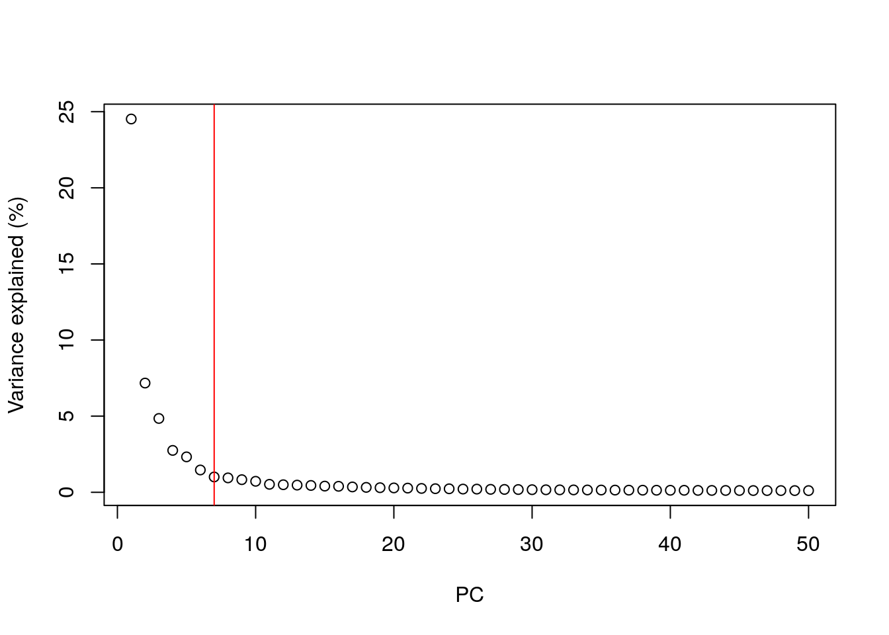

```{r setup, include=FALSE}
knitr::opts_chunk$set(echo = TRUE)
```

## 1.简介

数据准备
```{r}
#--- loading ---#
library(scRNAseq)
sce.zeisel <- ZeiselBrainData()

library(scater)
sce.zeisel <- aggregateAcrossFeatures(sce.zeisel, 
    id=sub("_loc[0-9]+$", "", rownames(sce.zeisel)))

#--- gene-annotation ---#
library(org.Mm.eg.db)
rowData(sce.zeisel)$Ensembl <- mapIds(org.Mm.eg.db, 
    keys=rownames(sce.zeisel), keytype="SYMBOL", column="ENSEMBL")

#--- quality-control ---#
stats <- perCellQCMetrics(sce.zeisel, subsets=list(
    Mt=rowData(sce.zeisel)$featureType=="mito"))
qc <- quickPerCellQC(stats, percent_subsets=c("altexps_ERCC_percent", 
    "subsets_Mt_percent"))
sce.zeisel <- sce.zeisel[,!qc$discard]

#--- normalization ---#
library(scran)
set.seed(1000)
clusters <- quickCluster(sce.zeisel)
sce.zeisel <- computeSumFactors(sce.zeisel, cluster=clusters) 
sce.zeisel <- logNormCounts(sce.zeisel)

#--- variance-modelling ---#
dec.zeisel <- modelGeneVarWithSpikes(sce.zeisel, "ERCC")
top.hvgs <- getTopHVGs(dec.zeisel, prop=0.1)

```
## 2.主成分分析PCA
我们是用 `scater` 中的 `runPCA()` 函数来对Log化后的表达量做PCA; 
如果主成份较多, 那么可能会导致有噪声, 这时可以指定PCA结果只包括HVG基因集 来减轻噪声影响

```{r}
library(scran)
top.zeisel <- getTopHVGs(dec.zeisel, n=2000)

library(scater)
set.seed(100) # See below.
sce.zeisel <- runPCA(sce.zeisel, subset_row=top.zeisel) 
reducedDimNames(sce.zeisel)

dim(reducedDim(sce.zeisel, "PCA"))
```

对于较大的数据集是用 `SVD`算法的效率更高
可以对`BSPARAM`传一个指定使用的SVD算法
```{r}
library(BiocSingular)
set.seed(1000)
sce.zeisel <- runPCA(sce.zeisel, subset_row=top.zeisel, 
    BSPARAM=RandomParam(), name="IRLBA")
reducedDimNames(sce.zeisel)
```

#### 2.1 主成分的保留

多少个PCs可以保留用于下游分析? 选择PC的数目和选择多少个HVG的概念差不多; 使用较多的PC可以保留更多的生物学信号, 但是也会保留更多的噪声; 因此选择主成分的数目用于下游分析 是一个值得讨论的问题.


#### 2.2 使用 elbow point

一个简单的启发式选择d的方法是绘制出每个主成分的解释方差曲线, 然后识别elbow point(拐点)

```{r}
# Percentage of variance explained is tucked away in the attributes.
percent.var <- attr(reducedDim(sce.zeisel), "percentVar")
chosen.elbow <- PCAtools::findElbowPoint(percent.var)
chosen.elbow
plot(percent.var, xlab="PC", ylab="Variance explained (%)")
abline(v=chosen.elbow, col="red")
```

如图所示的红线处就是elbow point
但是如果这样的话, 我们能选到的PCs就比较少了, 从而排除掉后面的PCs, 也许会损失一些有趣的生物学信息



#### 2.3 使用技术噪声
另一种策略是保留所有PC, 设置一个阈值, PC解释的方差小于阈值的就去除,大于的就保留; 例如仅保留解释方差为80%的主成分(PCs)
我们可以使用 `denoisePCA()`函数计算从`modelGeneVarWithSpikes()`得到的结果中的生物成分的比例，来制定阈值T的取值范围;

```{r}
#--- loading ---#
library(BiocFileCache)
bfc <- BiocFileCache("raw_data", ask = FALSE)
raw.path <- bfcrpath(bfc, file.path("http://cf.10xgenomics.com/samples",
    "cell-exp/2.1.0/pbmc4k/pbmc4k_raw_gene_bc_matrices.tar.gz"))
untar(raw.path, exdir=file.path(tempdir(), "pbmc4k"))

library(DropletUtils)
fname <- file.path(tempdir(), "pbmc4k/raw_gene_bc_matrices/GRCh38")
sce.pbmc <- read10xCounts(fname, col.names=TRUE)

#--- gene-annotation ---#
library(scater)
rownames(sce.pbmc) <- uniquifyFeatureNames(
    rowData(sce.pbmc)$ID, rowData(sce.pbmc)$Symbol)

library(EnsDb.Hsapiens.v86)
location <- mapIds(EnsDb.Hsapiens.v86, keys=rowData(sce.pbmc)$ID, 
    column="SEQNAME", keytype="GENEID")

#--- cell-detection ---#
set.seed(100)
e.out <- emptyDrops(counts(sce.pbmc))
sce.pbmc <- sce.pbmc[,which(e.out$FDR <= 0.001)]

#--- quality-control ---#
stats <- perCellQCMetrics(sce.pbmc, subsets=list(Mito=which(location=="MT")))
high.mito <- isOutlier(stats$subsets_Mito_percent, type="higher")
sce.pbmc <- sce.pbmc[,!high.mito]

#--- normalization ---#
library(scran)
set.seed(1000)
clusters <- quickCluster(sce.pbmc)
sce.pbmc <- computeSumFactors(sce.pbmc, cluster=clusters)
sce.pbmc <- logNormCounts(sce.pbmc)

#--- variance-modelling ---#
set.seed(1001)
dec.pbmc <- modelGeneVarByPoisson(sce.pbmc)
top.pbmc <- getTopHVGs(dec.pbmc, prop=0.1)


#--- Denoise ---#
library(scran)
set.seed(111001001)
denoised.pbmc <- denoisePCA(sce.pbmc, technical=dec.pbmc, subset.row=top.pbmc)
ncol(reducedDim(denoised.pbmc))
```

输出的维数表示保留所有生物学变异所需的PC数量的下限。这种选择 
d
 这样做的动机是，更少的PC肯定会丢弃某些方面的生物信号。（当然，反过来是不正确的；不能保证保留的PC会捕获所有信号，只有在完全不进行降维的情况下，通常这才是可能的。）从实际的角度来看，该denoisePCA()方法通常会保留更多的PC与肘点法相比，前者不会将PC彼此进行比较，并且不太可能丢弃与变化的次要因素相对应的PC。不利的一面是，变异的许多次要方面可能并没有引起人们的兴趣（例如，转录爆发），而且它们的保留只会增加无关的噪音。因此，这是否是一种“更好”的方法，取决于我们是否愿意增加噪声以保留较弱的生物信号。
 
#### 2.4 基于细胞群体的结构


## 3. 非负矩阵分解NMF
非负矩阵分解（NMF）涉及通过两个较低秩矩阵的乘积来近似矩阵  
在和H，它们只能包含非负条目。这在概念上与PCA相似，因为我们的目标是使用较小的矩阵总结矩阵中的主要特征，从而减少噪声并压缩数据。但是，NMF坐标更容易解释，因为较大的值明确表示相应因子中基因的较大表达；对于PCA坐标不能说相同，如果旋转矢量的相应项为负，则其可能由较高的表达式引起负值。

```{r}
set.seed(101001)
nmf.zeisel <- runNMF(sce.zeisel, ncomponents=10, subset_row=top.zeisel)

# Extracting the basis matrix of per-gene contributions to each factor.
nmf.out <- reducedDim(nmf.zeisel, "NMF")
nmf.basis <- attr(nmf.out, "basis")
colnames(nmf.out) <- colnames(nmf.basis) <- 1:10

# Creating a heatmap where each row is a cell:
per.cell <- pheatmap::pheatmap(nmf.out, silent=TRUE, 
    main="By cell", show_rownames=FALSE,
    color=rev(viridis::magma(100)), cluster_cols=FALSE) 

# Creating a heatmap where each row is a gene:
per.gene <- pheatmap::pheatmap(nmf.basis, silent=TRUE, 
    main="By gene", cluster_cols=FALSE, show_rownames=FALSE,
    color=rev(viridis::magma(100)))

gridExtra::grid.arrange(per.cell[[4]], per.gene[[4]], ncol=2)
```


## 4. 降维可视化


