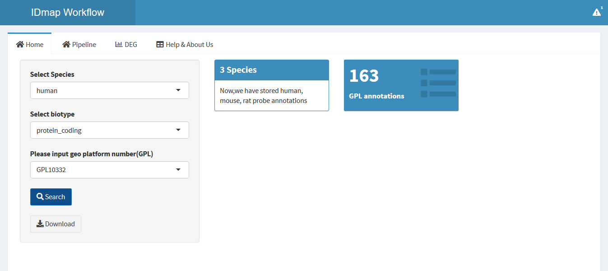
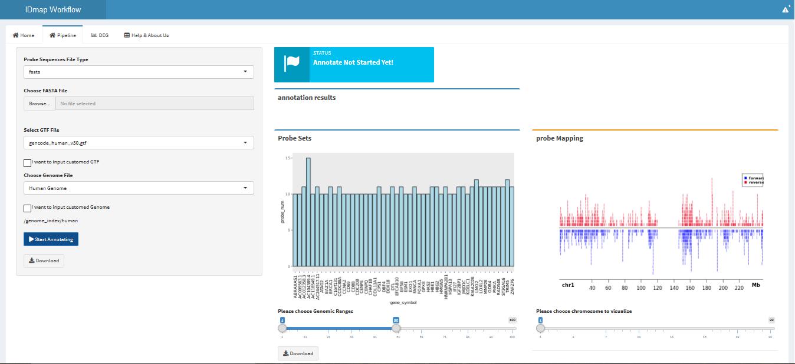

```{r setup, include = FALSE}
knitr::opts_chunk$set(
  collapse = TRUE,
  comment = "#>"
)
```


```{r echo=FALSE, results='hide', message=FALSE}
#library(AnnoProbe)
```


## 1. Introduction
AnnoProbe is a database contains 146 probe annotations which integrated of Soft Annotations from GEO , Bioconductor Annotations from Bioconductor as well as Customed probe annotations annotated by our pipeline. AnnoProbe allows users to quickly and easily access the latest probe annotations and improve their data analysis qualities.

In addition, AnnoProbe web-interface (http://192.144.162.230:3838/AnnoProbe/)  provides a self-annotating workflow that helps users quickly get customed probe annotations.

```{r}
library(AnnoProbe)
```

## 2. Accessing probe annotation data from AnnoProbe database
Before get annotation data from AnnoProbe, please use function `checkGPL` or `getGPLlist` to check your GEO Platform is in our annotation list. Otherwise, you can use our `AnnoProbe Web-Interface` (Introduce as followings ) to custom re-annotate your probe sets or `getGPLsoft` function to download annotations from GEO.

```{r}
checkGPL("GPL13607")
#gpl13607 <- getGPLsoft("GPL13607", destdir="./inst/extdata/")
```

We perform function `getAnno` to help users access probe annotations.
`getAnno` has four parameters: _gplnum_ , _source_ , _biotype_ and _lncRNA_ 

+ `gplnum` : The GEO Platform Accession Number
+ `source` : Where the annotation data comes from. (`pipe` refs to our customed annotations, `soft` soft annotations download from GEO and companies' websites, `bioc` bioconductor annotations integrated from bioconductor packages ) 
+ `biotype` : Gene biotypes in GENCODE(eg. protein-coding, non_coding ...)
+ `lncRNA` : The default is FALSE. (if select `True` , users can access the lncRNA arrays annotaion data produced by our customed pipeline)

```{r}
gplnum <- "GPL10332"
humanAnno <- getAnno(gplnum,source="pipe")
head(humanAnno)
```

## 3. Matching probeids with gene symbols
Function `probeIdmap` matching probeids with gene symbols

+ `gplnum` The GEO Platform Accession Number
+ `datasets` The probe annotations, which contains the corresponding relationship of gene symbols and probe ids
+ `probeIdcol` The column name of probe ids in annotation datasets 

Notes: This function will lose some probe ids that are not in the gene annotations
```{r}
probeids <- c("A_23_P101521","A_33_P3695548","A_33_P3266889")
gplnum <- "GPL10332"
datasets <- getAnno(gplnum,source="pipe")
head(datasets)
mapRes <- probeIdmap(probeids, datasets, probeIdcol = "probe_id")
mapRes <- na.omit(mapRes) ## filter NA ids
head(mapRes)
```

## 4. Using AnnoProbe Web-Interface to re-annotate probe sequences
AnnoProbe Workflow is a shinyApp to re-annotate probe sequences (Avaliable at: http://192.144.162.230:3838/AnnoProbe/ ).

In Home page, users can download probe annotations directly by **`search`** and **`download`** buttons .


In Pipeline page, users are able to custome re-annotate their microarray probe sequences .



For more details, please visit the website.

## 5. Other Functions

#### 5.1 Filter expression matrix
Function `filterEM` 

```{r}
eMatrix <- system.file("extdata", "matrixData.Rdata", package="AnnoProbe")
allMapIds <- system.file("extdata", "probe2gene.Rdata", package="AnnoProbe")
load(eMatrix)
load(allMapIds)
## head(matrixData)
## head(probe2gene)
res <- filterEM(matrixData,probe2gene,omitNA=T)
head(res)
```

#### 5.2 Converting gene symbols to other Ids


## 6. Case Study : Data Mining with microarray data deposited in GEO

There are many valuable microarray data sets deposited in GEO database. We can download those data and perform bioinformatics analysis to reveal new biological insights . Following is a case study for users using `AnnoProbe` package to remine GEO data sets.

#### 6.1 Download microarray data from GEO
```{r}
library(AnnoProbe)
library(GEOquery)
## download GSE27533 data
gse27533 <- getGEO('GSE27533', destdir=".", AnnotGPL = F, getGPL = F)  
## expression matrix
eset <- exprs(gse27533[[1]])
head(eset)
## pheno data
phenoDat <- pData(gse27533[[1]])
head(phenoDat)
```

#### 6.2 Differential gene expression analysis
```{r}
#library(limma)
#design = model.matrix(~0+factor( groupList ))
#colnames(design)=levels(factor(groupList))
#design
#contrast.matrix<-makeContrasts("control-IL17A",
#                                levels = design)
##step1
#fit <- lmFit(dat,design)
##step2
#fit2 <- contrasts.fit(fit, contrast.matrix) 
#fit2 <- eBayes(fit2)  ## default no trend !!!
##step3
#tempOutput = topTable(fit2, coef=1, n=Inf)
#nrDEG = na.omit(tempOutput) 
 
```

#### 6.3 Gene ontology enrichment
```{r}


```

## 7. Data Updates
AnnoProbe probe annotaion data will be updated per three months. 

## 8. Help
If you have questions/issues, please visit AnnoProbe help homepage first. Your problems are mostly documented. If you think you found a bug, please follow the guide and provide a reproducible example to be posted on github issue tracker. For questions,  please post to Bioconductor support site and tag your post with AnnoProbe or connect Email : XXXX AT XXX .

